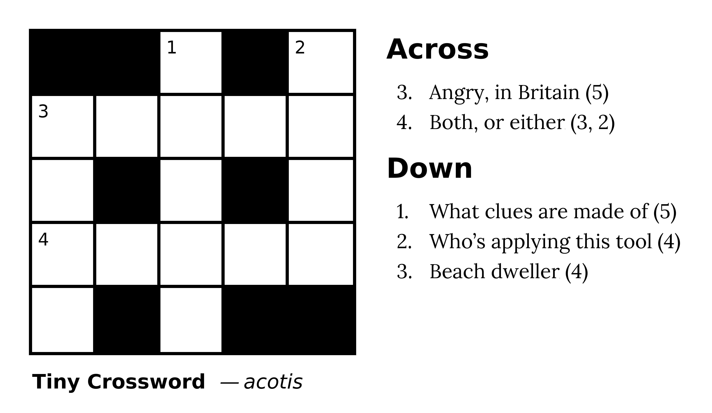
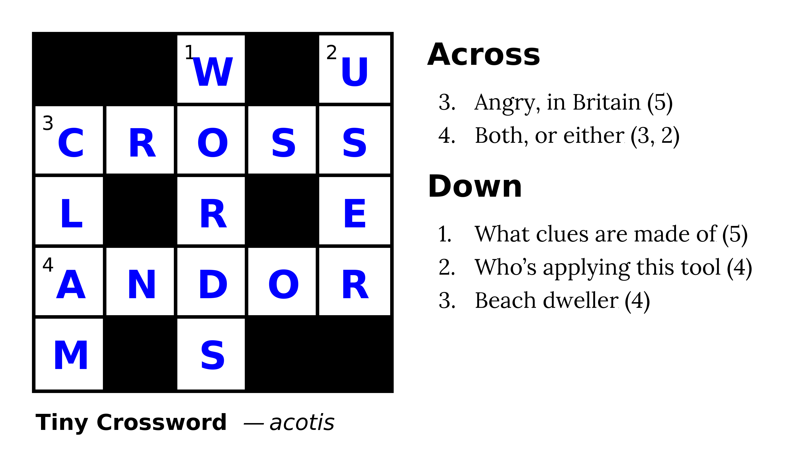
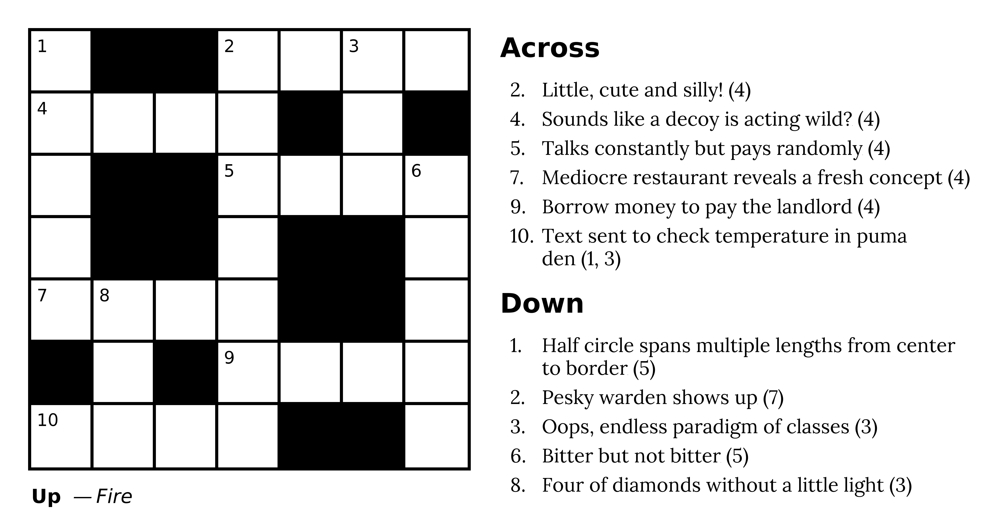

# What is this?

A simple utility to render crossword puzzles.

Here's a complete example input file:

```
. . W . U
C R O S S
L . R . E
A N D O R
M . S . .

@Title: Tiny Crossword
@Author: acotis

CROSS: Angry, in Britain
WORDS: What clues are made of
USER: Who's applying this tool
AND OR: Both, or either
CLAM: Beach dweller

%%%%%%%%%%%%%%%%%%%

Comments can go below this line

```

Running this command:

```
cargo run --release examples/tiny.txt
```

Produces two files, `puzzle.png` and `answer_key.png`, which look like this:




# Format

In the puzzle body, `.` means a black square and any letter means a white square with that letter in it. Spaces are ignored.

In the clue list, simply write the answer word, then a colon, then the clue you want to give for that word. Put one clue on each line.

Clues are automatically marked with their answer lengths. If the answer has more than one word, write it that way in the clue line and the length hint will reflect it.

Any line with `%%%` causes parsing to stop. You can put comments or whatever other junk you want after that line and the tool will ignore it.

## Title, author, and text-wrapping

- Use `@Title: Hello world` to set the title.
- Use `@Author: Jane Doe` to set the author.
- Use `@Clue-Width: 2500` to set the width (in pixels) that clues are allowed to take up. Clue texts automatically wrap at word boundaries.

## Formatting work-in-progress puzzles

Replace any letter with a non-space, non-`.` character, and the tool will interpret that tile as a blank tile that you haven't yet chosen a letter for. Answers intersecting that tile will be given placeholder clues in the clue column. See `examples/incomplete.txt` for an example.

# A larger example

Here's a UK-style crossword I created with this tool.



# License

All Rust code in this project is hereby in the public domain. The fonts are not mine and continue to be licensed under whatever license they already have.

