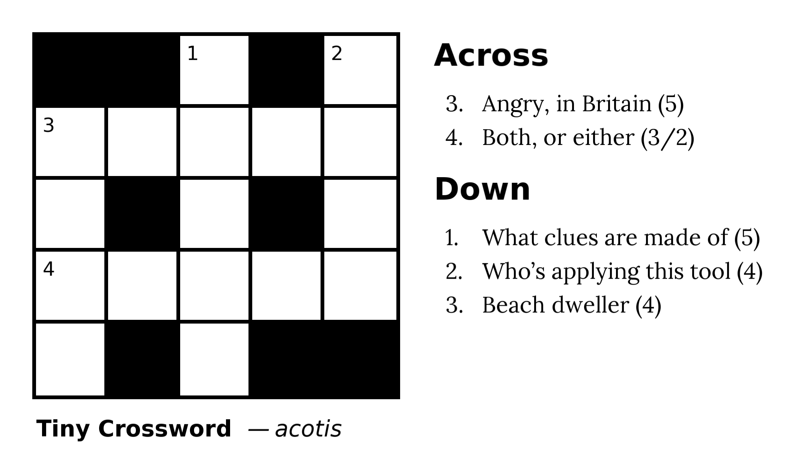
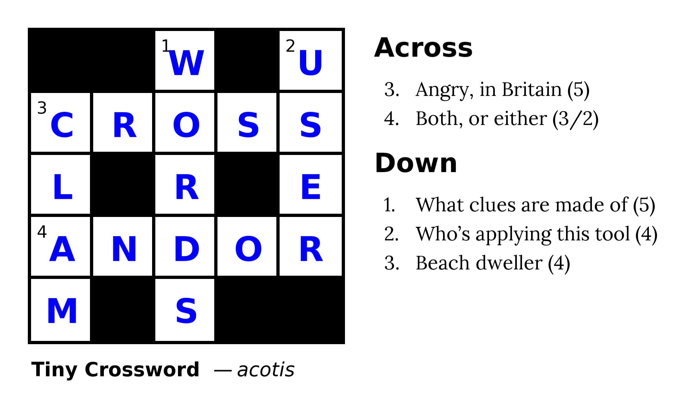
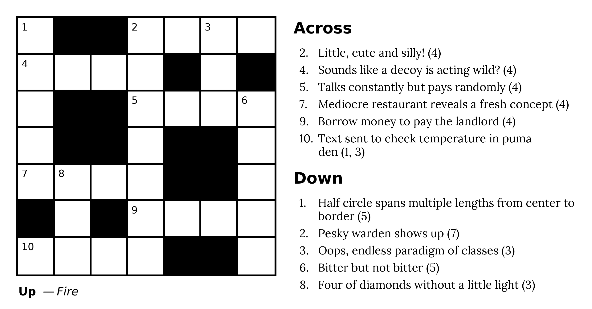
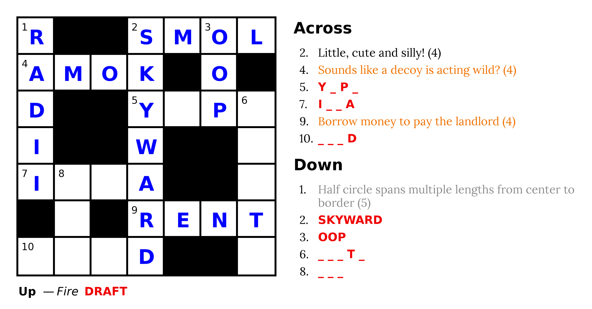

# What is this?

A simple utility to render crossword puzzles.

Here's a complete example input file:

```
. . W . U
C R O S S
L . R . E
A N D O R
M . S . .

@Title: Tiny Crossword
@Author: acotis

CROSS: Angry, in Britain
WORDS: What clues are made of   // This is a comment
USER: Who's applying this tool
AND/OR: Both, or either
CLAM: Beach dweller

%%%%%%%%%%%%%%%%%%%

Any text down here is ignored

```

Running this command:

```
cargo run --release examples/tiny.txt
```

Produces two files, `puzzle.png` and `answer_key.png`, which look like this:




# Format

In the puzzle body, `.` means a black square and any letter means a white square with that letter in it. Spaces are ignored.

In the clue list, simply write the answer word, then a colon, then the clue you want to give for that word. Put one answer/clue pair on each line.

Clues are automatically marked with their answer lengths. If the answer has more than one word, or things like hyphens, write it that way in the clue line and the length hint will reflect it.

Any line with `%%%` causes parsing to stop. You can put comments or whatever other junk you want after that line and the tool will ignore it.

## More features

- Use `@Title: Hello world` to set the title.
- Use `@Author: Jane Doe` to set the author.
- Use `@Clue-Width: 6` to set the width that clues are allowed to take up, measured in grid-tiles. Clue texts automatically wrap at word boundaries.
- Use `@Clue-With-Col-2: 6` to put the Down clues in a separate column and also specify the maximum width of that column.
- In the grid, use `0` or any other non-letter character to indicate a white square that you haven't chosen a letter for yet. The tile will appear blank even in the answer key, and a placeholder clue will be created for words that cross through it. See `examples/up_incomplete.txt` for an example.
- On any line, use `//` to create a comment, as in `ANSWER: Clue clue clue // comment`.
- Preface a clue with `@Tentative` to mark it as tentative; it will show up in orange in the image render.

## Error handling

This tool has very poor error handling. Do just about anything wrong and it crashes. Sorry!

# Gallery

Here are some more outputs from the tool. All clues are UK-style "cryptic" clues.





# License

All Rust code in this project is hereby in the public domain. The fonts are not mine and continue to be licensed under whatever license they already have.

